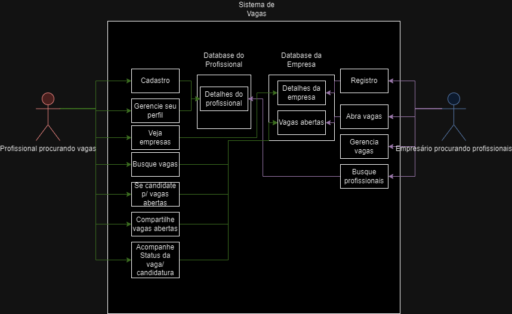

# Especificações do Projeto

## Personas

<figure style="display: flex; align-items: flex-start;">
  
  <figcaption> <b>Teresa</b>:  
    Teresa tem 40 anos, tem uma filha, é jornalista e estuda Análise e Desenvolvimento de Sistemas, a distância, em uma universidade de Minas Gerais. Pensa em fazer transição de carreira para a área de tecnologia da informação, mas teme ter dificuldade de encontrar oportunidades de trabalho, em virtude da sua idade e por não ter uma rede de contatos com pessoas que atuem no setor de TI.  
    Motivada pela sua paixão por desafios e pelo desejo de constante aprendizado, Teresa enfrentou inúmeras situações ao longo de sua carreira como jornalista. Ela acredita que essa mesma determinação a capacitará a se destacar na área de tecnologia. No entanto, a incerteza sobre o futuro a frustra em momentos de reflexão. Seu tempo ao ar livre, desbravando trilhas, sempre lhe proporcionou clareza e tranquilidade para superar obstáculos. Agora, enquanto estuda Análise e Desenvolvimento de Sistemas, ela está pronta para combinar sua curiosidade inata com suas novas habilidades técnicas.  
    Além disso, Teresa descobriu que o mundo da programação é como uma nova forma de expressão, onde a lógica se mescla com a criatividade. Seu hobby de pintura se encaixa surpreendentemente bem nessa nova paixão. Com a determinação que a impulsionou como jornalista, Teresa está empenhada em construir um perfil que evidencie suas habilidades como desenvolvedora de software, permitindo que empresas de TI a encontrem com facilidade. Ela sabe que o caminho pode ser desafiador, mas sua motivação, combinada com a satisfação que encontra em aprender algo novo a cada dia, a impulsionará a alcançar seus objetivos, mesmo que isso signifique começar de novo.  
    <b>Aplicativos:</b> LinkedIn, WhatsApp, Facebook, Netflix, Youtube
  </figcaption>
</figure>

<figure style="display: flex; align-items: flex-start;">
  
  <figcaption> <b>Albano</b>:  
    Albano, um engenheiro agrônomo de 52 anos, encontrou seu trilho na inovação e na terra fértil da agricultura de precisão. Como sócio fundador de uma startup que revoluciona a forma como encaramos a produção agrícola, ele viu sementes de ideias se transformarem em soluções concretas. Com uma determinação implacável, a equipe da startup floresceu quatro vezes ao longo de três anos, respondendo à crescente demanda por sua abordagem disruptiva. Olhando adiante, Albano vislumbra um novo desafio emocionante: até o final de 2023, a empresa almeja adicionar o talento de oito novos membros à equipe, incluindo desenvolvedores de software e analistas comerciais.  
    No íntimo, Albano é movido pela paixão de selecionar os candidatos perfeitos para sua empresa. Ele está determinado a anunciar vagas de trabalho que atraíam indivíduos não apenas com habilidades excepcionais, mas também com afinidade aos valores e visão que impulsionam a equipe. Como um verdadeiro artesão de equipe, sua ambição é criar oportunidades de impacto para profissionais que compartilham a mesma visão inspiradora.  
    Mas a busca por talento não é isenta de desafios. Albano enfrenta a frustração de encontrar o equilíbrio entre as "hard skills" necessárias para as funções e a paixão que alinha as pessoas com o propósito da empresa. Ele compreende a necessidade de encontrar candidatos que possam combinar o conhecimento técnico com a paixão e a dedicação que movem a startup adiante.  
    <b>Aplicativos:</b> LinkedIn, Whatsapp, Google Meet, Agrivi, Climate FieldView, Agworld.
  </figcaption>
</figure>

<figure style="display: flex; align-items: flex-start;">
  
  <figcaption> <b>Victor Almeida</b>:  
    Com seus 38 anos, Victor Almeida assume o papel influente de Sócio e Diretor em uma destacada empresa de Desenvolvimento de Software e criação de websites. Com uma bagagem que se estende por mais de duas décadas, é um veterano na área de tecnologia da informação e gestão de projetos. Seu percurso é um mosaico de inovação e liderança, que ganha forma com cada projeto conquistado e equipe direcionada.  
    Enquanto capitaneia a empresa, Victor enfrenta um cenário desafiador na busca por profissionais qualificados. A dificuldade reside na escassez de candidatos que possuam a experiência necessária na área de TI e também estejam comprometidos a trilhar um percurso duradouro no campo. O desafio de encontrar indivíduos que conjuguem habilidades técnicas fundamentais com uma visão a longo prazo é uma incógnita que ele se esforça em decifrar diariamente.  
    Nos bastidores da gestão e codificação, Victor encontra equilíbrio nos hobbies que energizam sua mente. Ele tem uma paixão pela astronomia e observação de estrelas, o que espelha sua visão de longo alcance no mundo da tecnologia. Assim como ele busca nas estrelas os segredos do universo, ele também busca no talento humano os pilares para o sucesso de sua empresa..  
    <b>Aplicativos:</b> LinkedIn, Whatsapp, Google Meet.
  </figcaption>
</figure>

<figure style="display: flex; align-items: flex-start;">
  
  <figcaption> <b>Aurora Barcelos</b>:  
    Aurora Barcelos, uma jovem de 25 anos, emergiu recentemente com um diploma em Ciência da Computação. Sua trajetória acadêmica brilha com realizações, marcada por um desempenho exemplar e a participação em projetos de pesquisa e desenvolvimento na empolgante área de inteligência artificial. Contudo, apesar da base sólida construída durante sua formação, Aurora enfrenta barreiras ao tentar trilhar seu caminho no mercado de TI. Uma névoa de desafios surge à sua frente, principalmente devido à exigência de experiência profissional relevante, algo que ela ainda não acumulou. Em meio a essa jornada, ela também sente a presença marcante de uma concorrência acirrada, onde candidatos mais experientes batalham pelas mesmas oportunidades.   
    Guiada por ambição e determinação, Aurora tem o desejo fervente de não apenas entrar no mercado de TI, mas também criar um impacto significativo. Ela busca ser uma peça ativa na engrenagem da inovação tecnológica, contribuindo com suas habilidades frescas e seu entusiasmo inabalável. Sua motivação para ingressar nesse campo está enraizada na curiosidade que a moveu durante seus anos acadêmicos, e agora ela anseia aplicar essa paixão em um cenário prático.   
    Apesar de sua determinação, as frustrações rondam Aurora. A barreira da falta de experiência em um campo que valoriza essa qualidade é um obstáculo complexo de superar. No entanto, essa frustração só serve para alimentar sua resolução de provar seu valor. Aurora busca oportunidades no mercado de TI, não apenas como um trampolim para sua carreira, mas como uma plataforma para aprimorar suas habilidades. Ela anseia por práticas reais e aprendizado tangível, onde possa colher o conhecimento que apenas a experiência prática pode proporcionar.   
    Nos intervalos da busca incansável por oportunidades, Aurora encontra conforto e expressão em suas atividades criativas. Seu amor pelas artes visuais e pelo desenho digital é uma fuga para um mundo onde ela pode dar vida a sua imaginação. Esse hobby oferece um espaço de descontração em meio aos desafios do mundo tecnológico e reflete sua natureza diversificada e criativa..  
    <b>Aplicativos:</b> LinkedIn, Whatsapp, Instagram, Pinterest.
  </figcaption>
</figure>

## Histórias de Usuários

Com base na análise das personas forma identificadas as seguintes histórias de usuários:

|EU COMO... `PERSONA`| QUERO/PRECISO ... `FUNCIONALIDADE` |PARA ... `MOTIVO/VALOR`                 |
|--------------------|------------------------------------|----------------------------------------|
|Teresa              | Localizar vagas de trabalho na modalidade home office | Conseguir uma oportunidade profissional como desenvolvedora mobile junior |
|Teresa              | Descrever no meu perfil as minhas habilidades como desenvolvedora de software | Ser encontrada por empresas de TI |
|Albano              | Anunciar vagas de trabalho | Selecionar profissionais com o perfil desejado pela minha empresa |
|Albano              | Localizar profissionais a partir das suas habilidades ("hard skills") | Convidar pessoas a ingressar na empresa sem precisar anunciar uma vaga na plataforma |
|Victor                | Encontrar profissionais qualificados na área de TI que estejam alinhados com os objetivos e necessidades da empresa. | Impulsionar o desenvolvimento de software, inovar, gerenciar projetos, oferecer suporte técnico, manter os sistemas e impulsionar o crescimento e a expansão de sua empresa de software. |
|Victor                | Contratar profissionais de TI altamente qualificados. |  Impulsionar o crescimento da equipe e garantir a satisfação dos clientes. |
|Aurora              | Ingressar no mercado de T.I | Impulsionar sua carreira profissional. |
|Aurora              | Oportunidade no mercado de T.I | Aprimorar suas habilidades e obter experiências praticas. |

## Requisitos

As tabelas que se seguem apresentam os requisitos funcionais e não funcionais que detalham o escopo do projeto.

### Requisitos Funcionais

|ID    | Descrição do Requisito  | Prioridade |
|------|-------------------------|------------|
|RF-001| A aplicação deve permitir que o usuário (empresa ou profissional) gerencie um perfil na plataforma | ALTA |
|RF-002| A aplicação deve permitir que a empresa gerencie vagas de trabalho | ALTA |
|RF-003| A aplicação deve permitir que o profissional se candidate a vagas de trabalho  | ALTA |
|RF-004| A aplicação deve permitir que o profissional encontre vagas por meio de um mecanismo de pesquisa  | ALTA |
|RF-005| A aplicação deve permitir que a empresa defina as qualificações que procura em um profissional | ALTA |
|RF-006| A aplicação deve permitir que o profissional se autoavalie de acordo com as qualificações definidas pela empresa | ALTA |
|RF-007| A aplicação deve permitir que a empresa visualize os resultados das autoavaliações | ALTA |
|RF-008| A aplicação deve permitir que a empresa encontre profissionais por meio de um mecanismo de pesquisa  | MÉDIA |
|RF-009| A aplicação deve permitir que o profissional acompanhe o status de suas candidaturas. | MÉDIA |
|RF-010| A aplicação deve permitir que os usuários compartilhem vagas através de redes sociais. | BAIXA |

### Requisitos não Funcionais

|ID     | Descrição do Requisito  | Prioridade |
|-------|-------------------------|------------|
|RNF-001| O sistema deve ser responsivo, de modo a ser adequadamente exibido em dispositivos móveis | MÉDIA |
|RNF-002| O sistema deve ser implementado na linguagem de programação C# | ALTA |
|RNF-003| O sistema deve manter o tempo máximo de resposta para qualquer interação do usuário na aplicação abaixo de 15 segundos | MÉDIA |
|RNF-004| O sistema deve ser capaz de suportar até 1000 usuários navegando simultaneamente, mantendo um tempo de resposta satisfatório e sem degradação significativa de desempenho | MÉDIA |
|RNF-005| O sistema deve garantir a segurança dos dados dos usuários, protegendo as informações pessoais e confidenciais armazenadas na aplicação | ALTA |

- [Requisitos Funcionais
 (RF)](https://pt.wikipedia.org/wiki/Requisito_funcional):
 correspondem a uma funcionalidade que deve estar presente na
  plataforma (ex: cadastro de usuário).
- [Requisitos Não Funcionais
  (RNF)](https://pt.wikipedia.org/wiki/Requisito_n%C3%A3o_funcional):
  correspondem a uma característica técnica, seja de usabilidade,
  desempenho, confiabilidade, segurança ou outro (ex: suporte a
  dispositivos iOS e Android).
Lembre-se que cada requisito deve corresponder à uma e somente uma
característica alvo da sua solução. Além disso, certifique-se de que
todos os aspectos capturados nas Histórias de Usuário foram cobertos.

## Restrições

O projeto está restrito pelos itens apresentados na tabela a seguir.

As questões que limitam a execução desse projeto e que se configuram como obrigações claras para o desenvolvimento do projeto em questão são apresentadas na tabela a seguir.

|ID| Restrição |
|--|-----------|
|RE-01|A aplicação deve ser entregue de forma plenamente funcional até 06/12/2023.  |
|RE-02|A aplicação deve ser desenvolvida exclusivamente pelos membros do grupo.  |
|RE-03|A apliação deve exigir que apenas os usuários residentes no Brasil de candidatem as vagas de emprego.

## Diagrama de Casos de Uso

[Arquivo .drawio (xmf).](./use_case_diagram.drawio)

Png:
