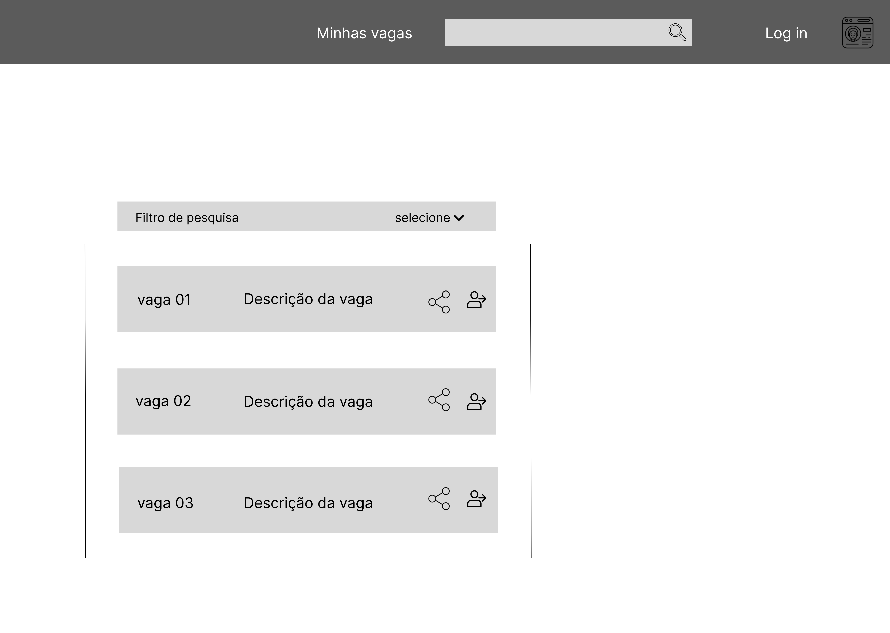
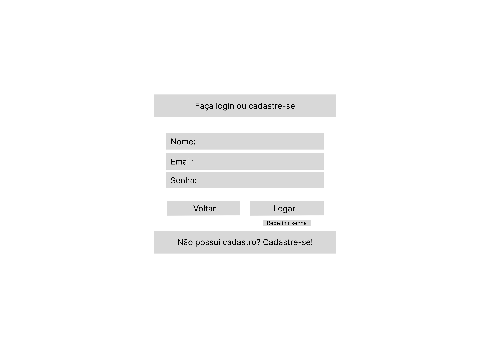
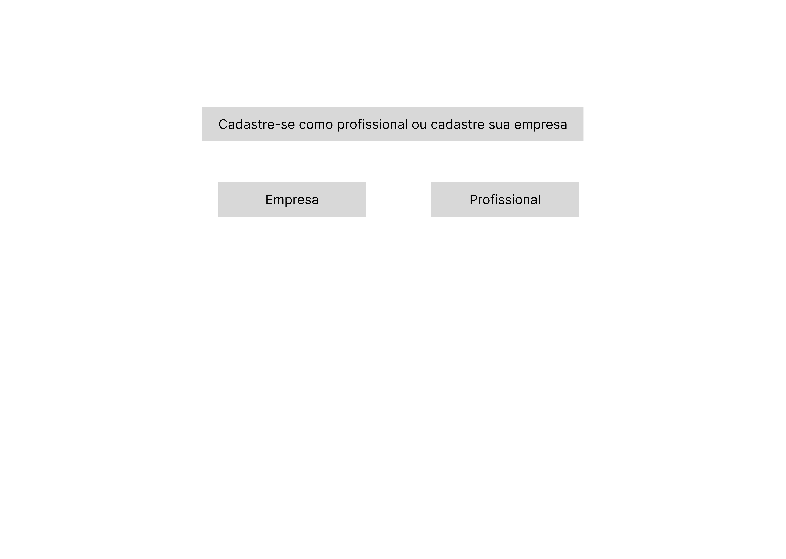
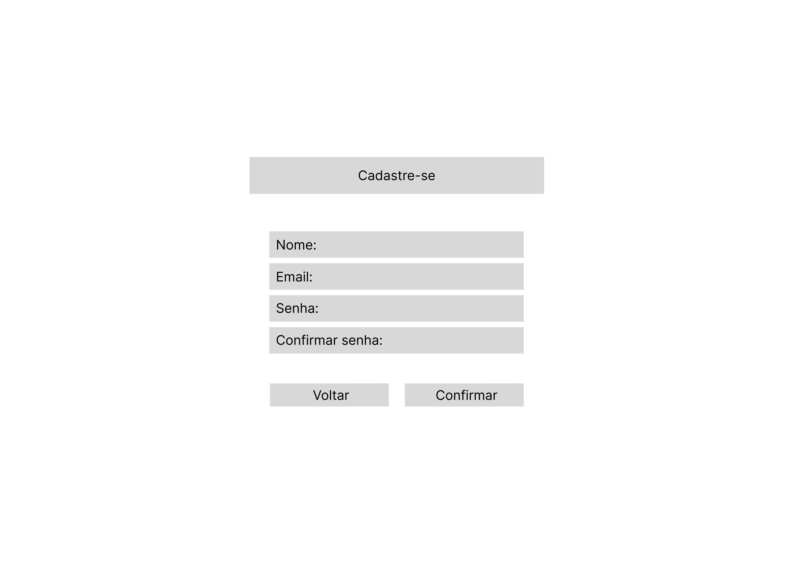
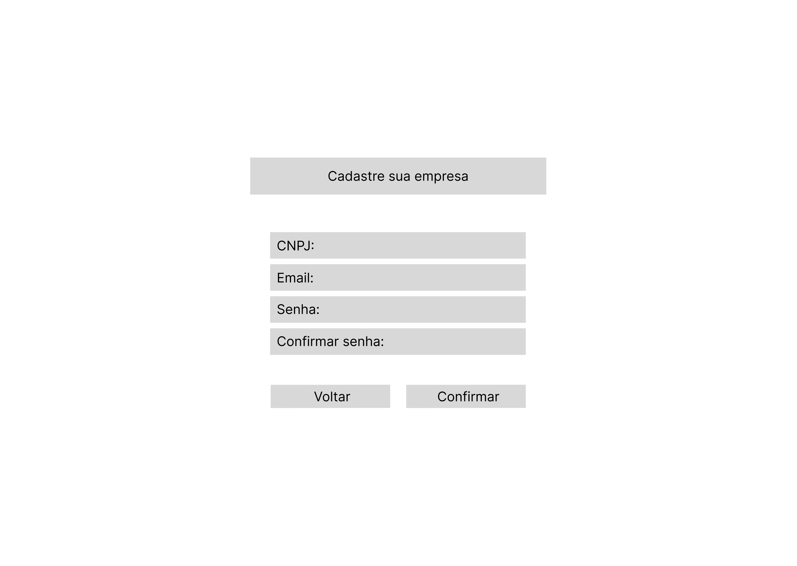
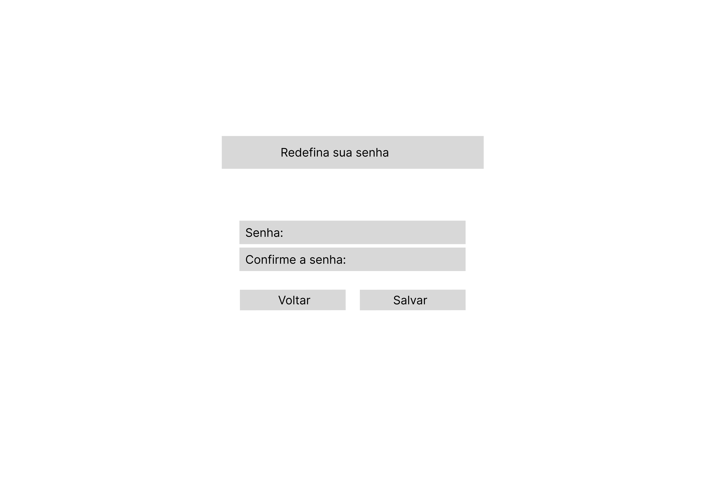
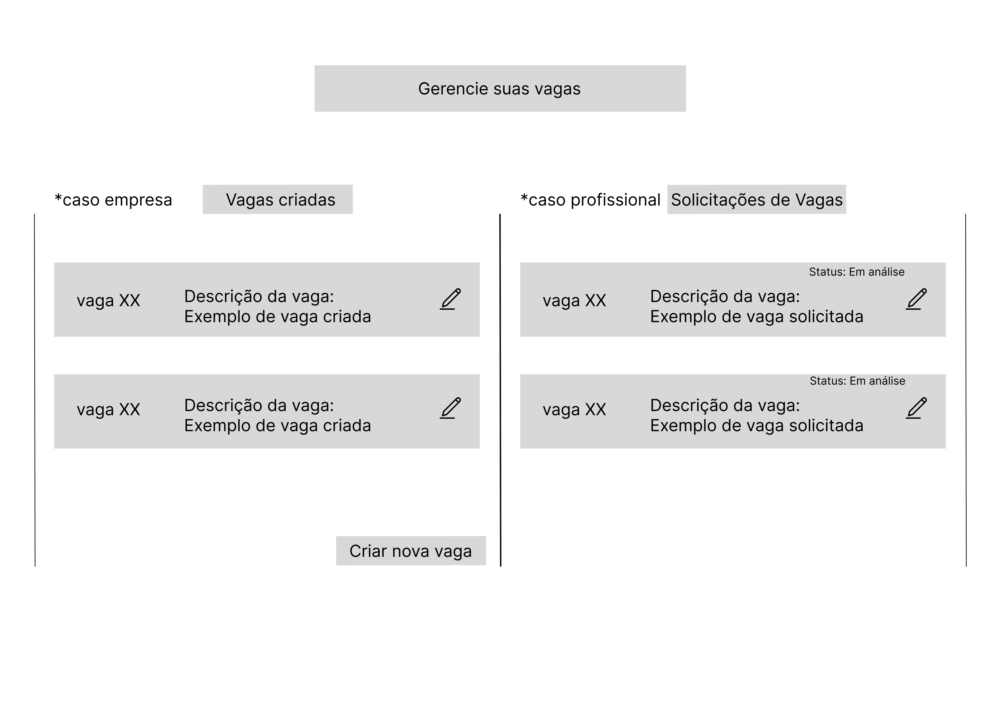
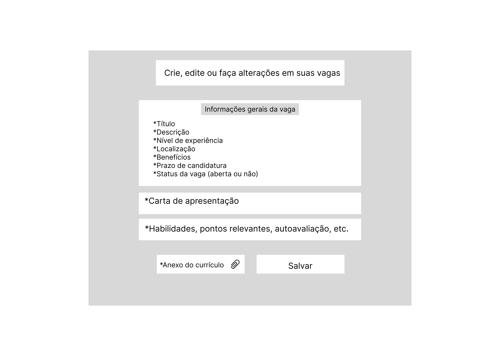
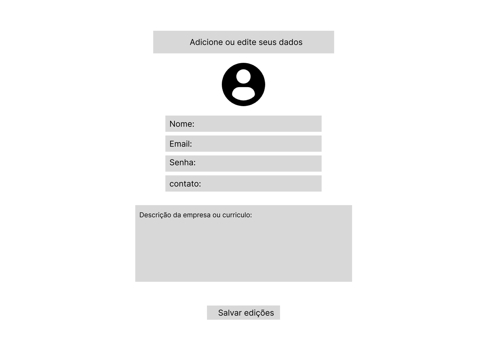
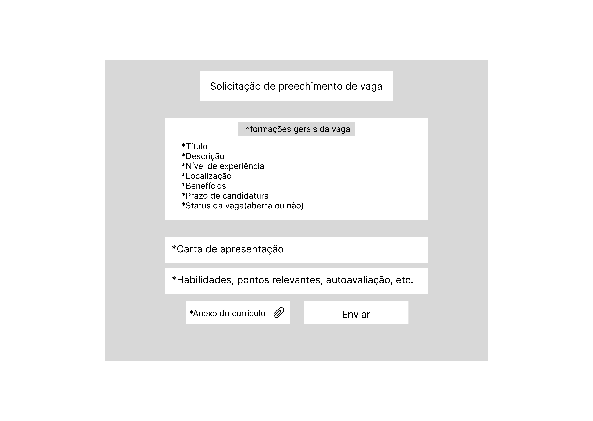

# Projeto de Interface

## Diagrama de Fluxo
Abaixo o diagrama de fluxo com o caminho a ser percorrido pelo usuário final do site.

### Fluxo do usuário (Profissional)

### Fluxo do usuário (Empresa)

## Wireframes

### Modo interativo
https://www.figma.com/proto/AM2U81Dy7HADBsDqdlFfxz/Wireframe-interativo?type=design&node-id=1-2&t=JuSSEfDVKu12dow5-0&scaling=min-zoom&page-id=0%3A1&starting-point-node-id=1%3A2

### Página inicial

### Página de login

### Página de escolha Empresa/Profissional

### Página de cadastro

### Página de cadastro empresarial

### Página de redefinição de senha

### Página de vagas

### Página Criar/Editar vagas

### Página de Edição dos dados do usuário

### Página de Preenchimento de vaga

###
