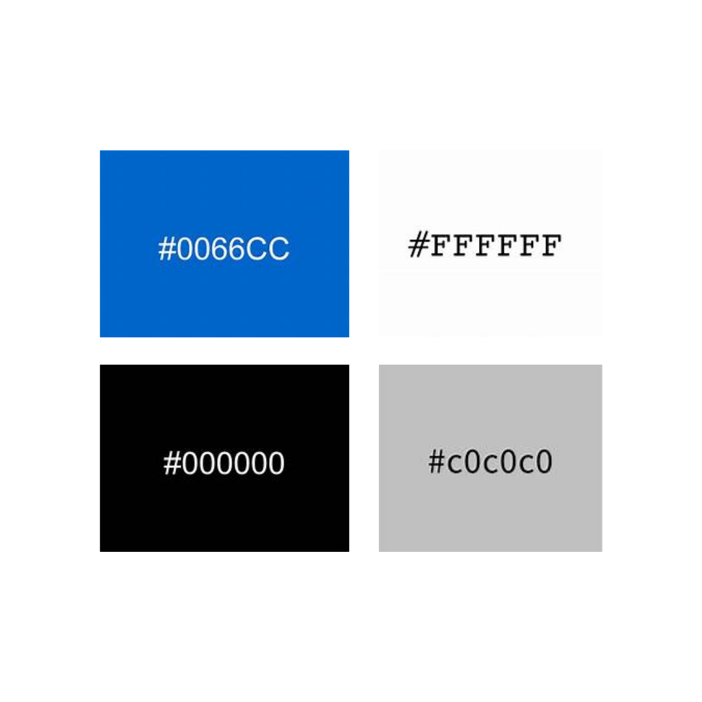

# Template Padrão da Aplicação

Pré-requisitos: <a href="2-Especificação do Projeto.md"> Especificação do Projeto</a>, <a href="3-Projeto de Interface.md"> Projeto de Interface</a>, <a href="4-Metodologia.md"> Metodologia</a>

Layout padrão da aplicação que será utilizado em todas as páginas com a definição de identidade visual, aspectos de responsividade e iconografia.

## Guia de Estilos 
Antes de estabelecer o template da aplicação, foi criado um guia de estilos, detalhado nos itens a seguir, que orientou os padrões de design da interface da aplicação.

### Paleta de cores 

Azul: O azul transmite uma sensação de confiança e estabilidade, o que pode ser importante para atrair profissionais da Tecnologia da Informação que buscam oportunidades de trabalho sólidas e confiáveis. O azul também é uma cor frequentemente associada à tecnologia, sendo utilizado por muitas empresas desse setor. Isso ajuda a criar uma conexão visual com o público-alvo. O azul é frequentemente utilizado em ambientes de trabalho empresariais devido às suas conotações de confiança, estabilidade e seriedade. É uma cor frequentemente encontrada em logotipos e materiais de empresas de diferentes setores. O azul também pode transmitir uma sensação de calma e produtividade, o que pode ser desejável em um ambiente profissional.

Cinza: O cinza transmite uma sensação de sofisticação e neutralidade, o que pode ser apreciado em um contexto profissional. Podendo ajudar a criar uma aparência elegante e discreta para a aplicação. O cinza é uma cor neutra e sóbria que pode ser associada a profissionalismo e formalidade. É frequentemente utilizado em trajes corporativos e elementos de design de escritório. O cinza pode transmitir uma sensação de neutralidade e discrição, o que pode ser valorizado em um ambiente de trabalho empresarial.

Preto: O preto é frequentemente associado à autoridade e ao profissionalismo. Transmitindo uma imagem de seriedade e importância, o que é relevante para uma aplicação de vagas de emprego voltada para profissionais da Tecnologia da Informaçãp. O preto é frequentemente associado a elegância, formalidade e sofisticação. Toques de preto transmitem uma sensação de prestígio e profissionalismo em um ambiente empresarial.

Branco: O branco transmite uma sensação de simplicidade e clareza, o que é útil em uma aplicação de vagas de emprego, onde as informações devem ser apresentadas de forma organizada e legível. 

> **Links Úteis**:
>
> - [CSS Website Layout (W3Schools)](https://www.w3schools.com/css/css_website_layout.asp)
> - [Website Page Layouts](http://www.cellbiol.com/bioinformatics_web_development/chapter-3-your-first-web-page-learning-html-and-css/website-page-layouts/)
> - [Perfect Liquid Layout](https://matthewjamestaylor.com/perfect-liquid-layouts)
> - [How and Why Icons Improve Your Web Design](https://usabilla.com/blog/how-and-why-icons-improve-you-web-design/)
