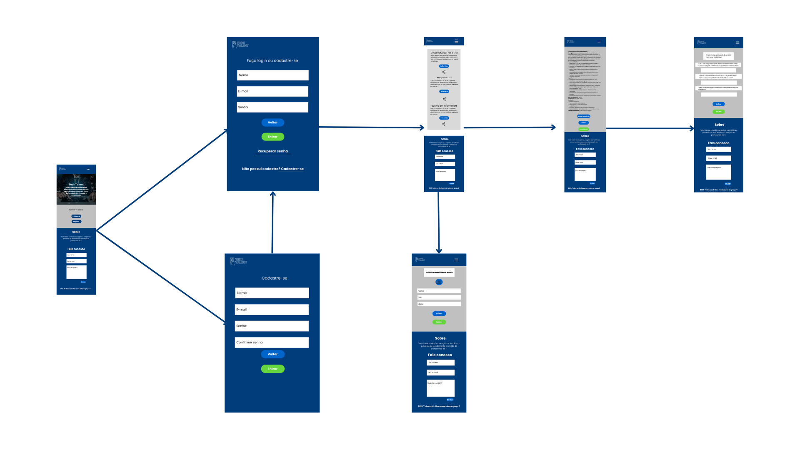

# Template Padrão da Aplicação

Pré-requisitos: <a href="2-Especificação do Projeto.md"> Especificação do Projeto</a>, <a href="3-Projeto de Interface.md"> Projeto de Interface</a>, <a href="4-Metodologia.md"> Metodologia</a>

Layout padrão da aplicação que será utilizado em todas as páginas com a definição de identidade visual, aspectos de responsividade e iconografia.

## Guia de Estilos 
Antes de estabelecer o template da aplicação, foi criado um guia de estilos, detalhado nos itens a seguir, que orientou os padrões de design da interface da aplicação.

### Paleta de cores 

A junção de todas essas cores criam uma paleta visual, equilibrada e completa para a aplicação.

#003d7a (Azul Escuro): O azul escuro transmite uma sensação de profissionalismo, confiança e estabilidade. Essa cor é frequentemente associada à seriedade e ao ambiente corporativo. Ao utilizar o azul escuro, estamos transmitindo uma imagem sólida e confiável para os usuários.

#F5F5F5 (Branco): O branco é uma cor neutra e limpa, frequentemente usada como cor de fundo. Ele cria uma sensação de espaço aberto, organização e simplicidade. O uso do branco transmiti uma aparência profissional e facilita a leitura e a navegação na aplicação.

#c0c0c0 (Cinza Claro): O cinza claro é uma cor neutra essa cor é menos intensa do que o branco, mas ainda mantém uma sensação de neutralidade e equilíbrio. Simplicidade e legibilidade as cores branco (#F5F5F5) e o cinza claro (#c0c0c0) são usadas para criar uma aparência limpa, organizada e de fácil leitura. Essas cores foram escolhidas para garantir que o conteúdo da aplicação seja facilmente legível e que a interface seja intuitiva para os usuários.

#000000 (Preto): O preto é uma cor elegante e sofisticada. No contexto da aplicação, o preto foi aplicado para dar um toque de sofisticação e profissionalismo, especialmente em títulos, cabeçalhos e elementos de destaque.

#0066CC (Azul Médio): O azul médio é uma cor que combina elementos de seriedade e confiança do azul escuro com um toque de energia e dinamismo. Essa cor foi usada para chamar a atenção para botões, links ou áreas interativas da aplicação, incentivando a ação e a exploração dos usuários.

#65D73D (Verde): O verde é frequentemente associado à natureza, crescimento e positividade. Nesse caso, o verde foi utilizado para transmitir uma sensação de progresso, sucesso e aprovação. Aplicado em botões de confirmação, indicadores de status ou áreas que destacam ações bem-sucedidas, como a submissão de candidaturas.

#EC3434 (Vermelho): O vermelho é uma cor vibrante e enérgica, que foi utilizada para chamar a atenção dos usuários e transmitir uma sensação de urgência ou alerta. O vermelho foi aplicado em mensagens de erro, avisos importantes ou em botões que demandam uma maior atenção do usuario. 

### Tipografia

A fonte escolhida para construção da interface foi a Poppins, que promove uma excelente legibilidade, mesmo em tamanhos menores ou em telas de dispositivos móveis, o que é importante, pois os usuarios precisam ler informações detalhadas, como descrições de trabalhos e requisitos. Essa fonte também possui um design moderno e limpo, transmitindo uma imagem atualizada e profissional para a aplicação, mantendo-a visualmente atraente para os usuários.

### Componentes e Ícones

Os componentes destacam as cores utilizadas.

Os ícones escolhidos são simples, trazendo uma sensação de familiaridade e confiança aos usuarios.

A logo foi desenvolvida de forma minimalista, utilizamos a cor branco para combinar com o tom de azul que foi utilizado no cabeçalho. A cor escolhida lembra simplicidade, coerencia e legibilidade.

## Fluxo de Telas 
O fluxo de telas mostra a trilha de uso do usuario pela aplicação.

Fluxo de tela do usuario (profissional)

Fluxo de telas do usuario (empresa)

### Aplicação nas telas 

Abaixo estão representadas as principais telas desenvolvidas, em suas versões para versão desktop e para versão mobile, e a explicação de suas funcionalidades.

## Home 
Ao acessar a aplicação, o usuário inicialmente visualiza a página de boas-vindas que contém um pequeno texto de apresentação da aplicação e as opções de entrar ou criar conta.

 

## Cadastro 
Para realizar o primeiro acesso na aplicação, o usuário (empresa ou profissional) precisa efetuar o cadastro com seus dados pessoais.

 

 

## Login 
Na tela login é possivel acessar a aplicação com um emaile e senha pré-cadastrado.

 

## Redefinir senha
Na tela redefinir senha permite aos usuários redefinir a senha de sua conta quando a esqueceram ou desejam alterá-la por motivos de segurança.

  

## Visualizar vagas
Essa tela permite que o usuario explore e examine oportunidades de emprego disponiveis, utilizando a lista de vagas ou o filtro de pesquisa.

 

## Criar Vagas 
A tela criar vagas permite que recrutadores inseriram informações sobre uma nova vaga de emprego que desejam anunciar. Essa tela permite que eles forneçam detalhes específicos sobre a posição e requisitos necessários. 

 

## Criar ou gerenciar perfil
A tela de criar ou gerenciar perfil permite aos usuários (empresa/profissional) criar ou atualizar informações pessoais e profissionais associadas à sua conta.

 

 

## Candidatar a vagas
Esta tela permite que o profissional envie informações e se inscreva na vaga que o mesmo selecionou.

 

## Gerenciar Vagas
A tela gerenciar vagas permite que os recrutadores visualizem, editem
ou excluam as vagas de emprego que eles criaram.

 

## Visualizar resultado das autoavaliações
Essa tela permite aos recrutadores visualizarem os resultados das autoavaliações dos candidatos que se candidataram a vaga criada pelo mesmo.

 

## Autoavaliação
Essa tela permite que o profissional responda um questionario fornecido pela empresa para avaliar suas habilidades.

 

## Definição da autoavvaliação
Essa tela permite que a empresa crie um questionario de acordo com as habilidades exigidas.

  

> **Links Úteis**:
>
> - [CSS Website Layout (W3Schools)](https://www.w3schools.com/css/css_website_layout.asp)
> - [Website Page Layouts](http://www.cellbiol.com/bioinformatics_web_development/chapter-3-your-first-web-page-learning-html-and-css/website-page-layouts/)
> - [Perfect Liquid Layout](https://matthewjamestaylor.com/perfect-liquid-layouts)
> - [How and Why Icons Improve Your Web Design](https://usabilla.com/blog/how-and-why-icons-improve-you-web-design/)
